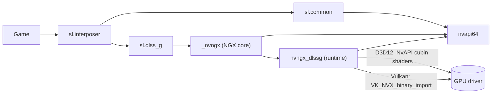
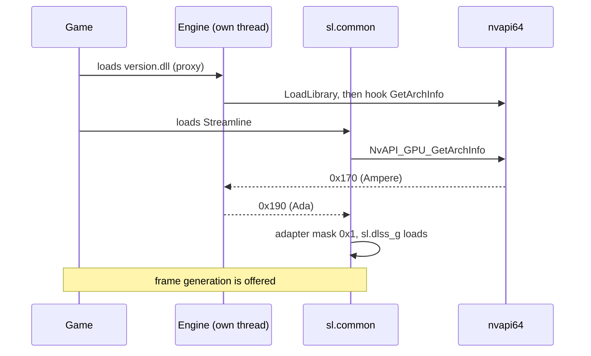
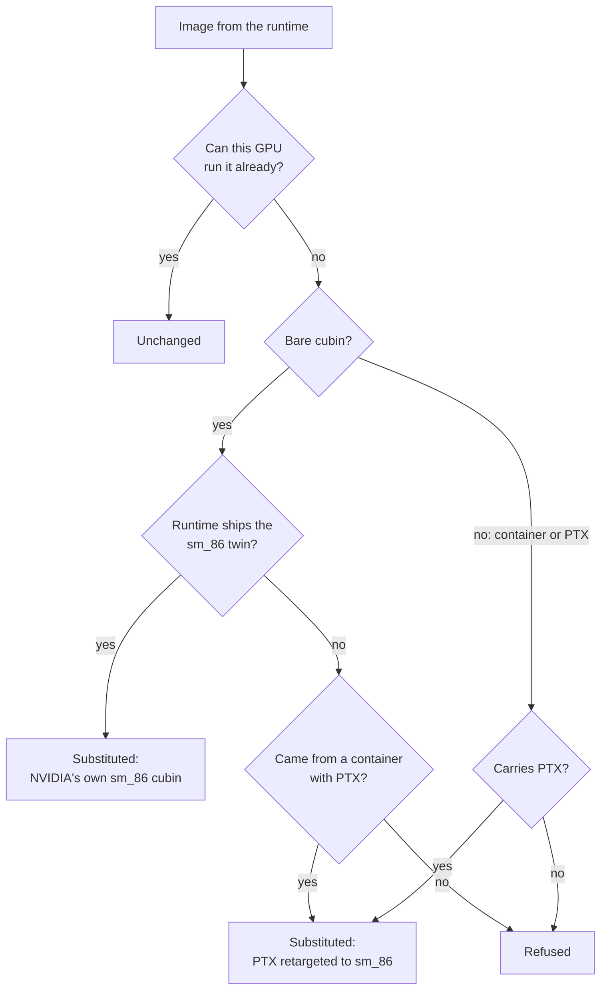

# How opendlssg-fg works

opendlssg-fg enables DLSS Frame Generation (DLSS-G) on RTX 30. It does not
generate frames itself: the game's own copy of NVIDIA's DLSS-G runtime does,
running the same code as on RTX 40. This project removes the two things that
stop that code running on Ampere:

1. **The software refuses to offer it.** Several components compare the GPU
   architecture against Ada and turn the feature off below it.
2. **The runtime has no kernels Ampere can run.** DLSS-G is a set of CUDA
   kernels, and the ones it hands to the driver are built for Ada.

- [The components](#the-components)
- [What is changed, and where](#what-is-changed-and-where)
- [Startup: opening the gates in time](#startup-opening-the-gates-in-time)
- [Gate 1: the adapter mask](#gate-1-the-adapter-mask)
- [Gate 2: the availability check](#gate-2-the-availability-check)
- [Gate 3: frame pacing](#gate-3-frame-pacing)
- [Gate 4: kernels](#gate-4-kernels)
- [Multi-frame generation](#multi-frame-generation)
- [Scope and safety](#scope-and-safety)
- [Diagnosing a problem](#diagnosing-a-problem)
- [Source map](#source-map)

## The components

The game ships Streamline and the DLSS-G runtime. The driver supplies NVAPI,
the NGX core and CUDA.

| Component | File | Ships with | Role |
|---|---|---|---|
| Streamline interposer | `sl.interposer.dll` | game | Entry point the game calls; loads plugins |
| Streamline common | `sl.common.dll` | game | Reads system capabilities, decides which plugins run |
| DLSS-G plugin | `sl.dlss_g.dll` | game | Streamline's wrapper around frame generation; paces output |
| DLSS-G runtime | `nvngx_dlssg.dll` | game | Frame generation itself: the CUDA kernels |
| NGX core | `_nvngx.dll` | driver | Loads NGX runtimes, answers capability queries |
| NVAPI | `nvapi64.dll` | driver | Driver API; reports the GPU architecture |
| CUDA driver | `nvcuda.dll` | driver | Compiles and runs kernels |



The project is a DLL the game already loads by name (`version.dll`,
`winmm.dll`, `dinput8.dll` or `dxgi.dll`). It forwards every export to the real
system DLL and hooks the functions listed below.

## What is changed, and where

Nothing on disk is modified. All changes are in memory, in the game's process,
and only on Ampere.

| # | Where | Change | Why |
|---|---|---|---|
| 1 | `nvapi64` `NvAPI_GPU_GetArchInfo` | Returns Ada instead of Ampere, to three callers only | Gates 1 and 2 |
| 2 | `nvapi64` `NvAPI_D3D12_SetRawScgPriority` | Returns success without running | Ada-only call that removes the device on older GPUs |
| 3 | `sl.dlss_g` flip-metering flag writes | Set to the plugin's software-pacing value | Gate 3: Ampere has no hardware flip metering |
| 3b | `nvngx_dlssg` comparisons against the Blackwell id | Compare against Ada instead | [Multi-frame](#multi-frame-generation): 3x and above |
| 4 | `nvapi64` `NvAPI_D3D12_CreateCubinComputeShaderExV2` | Kernel image replaced | Gate 4, Direct3D 12, one cubin at a time |
| 4b | `nvapi64` `NvAPI_D3D12_CreateCuModule` | Fatbin replaced | Gate 4, Direct3D 12, runtimes from 310.7 |
| 5 | Vulkan loader `vkGetDeviceProcAddr` and `vkGetInstanceProcAddr` | Return a wrapper for `vkCreateCuModuleNVX` | Gate 4, Vulkan |
| 6 | `kernel32` `LoadLibraryExW` | Wakes the worker thread on each load; applies 3b while the runtime loads | Timing |
| 7 | `sl.interposer` exports | Logged only | [Diagnostics](#diagnosing-a-problem) |

Off by default: lifting the plugin's frame-count clamp (`PatchFrameClamp`),
forcing a multiplier (`ForceMultiplier`), and loading a different runtime
(`[Runtime] Mode=Bundled`). A redirected runtime runs under its configured file
name, so that name is added to the callers told Ada.

## Startup: opening the gates in time

Streamline reads the GPU architecture once, in the first hundred milliseconds,
and uses that value from then on. A hook installed later has no effect.

`nvapi64.dll` is usually a static import of `sl.common.dll`, so it never goes
through `LoadLibrary` by name. The project therefore loads `nvapi64.dll` itself,
early, on its own thread, and hooks it before anyone else uses it.



Two rules for installing hooks:

- **No inline hook under the loader lock.** Installing one suspends all other
  threads, which can deadlock a thread inside `LoadLibrary`. The
  `LoadLibraryExW` hook only wakes a worker thread, which does the rest.
- **Publish the trampoline before enabling the hook.** Otherwise a thread can
  reach the hook with nothing to call; on `LoadLibraryExW` that fails a load the
  game asked for. `hooks::Install` always does this in order.

## Gate 1: the adapter mask

`sl.common` records each adapter's architecture and computes, per plugin, a mask
of adapters it may run on:

```
adapters[i].architecture >= info.minGPUArchitecture
```

DLSS-G requires Ada, `0x190`. With Ampere's real `0x170` the mask is empty and
the plugin is dropped:

```
getSystemCaps] Adapter 0 architecture 0x170
mapPlugins] Loaded plugin 'sl.dlss_g' - adapter mask 0x0
loadPlugins] Ignoring plugin 'sl.dlss_g' since it is not supported on this platform
```

With the spoof:

```
getSystemCaps] Adapter 0 architecture 0x190
mapPlugins] Loaded plugin 'sl.dlss_g' - adapter mask 0x1
```

### Who is told, and who must not be

The caller is identified from the return address. Three modules are told Ada;
everything else, including the game, sees the real GPU.

| Caller | Told | Reason |
|---|---|---|
| `sl.common.dll` | Ada | Computes the adapter mask (gate 1) |
| `_nvngx.dll` | Ada | Answers the availability query (gate 2) |
| `nvngx_dlssg.dll` | Ada | The runtime; creates no kernels otherwise |
| the game, `sl.interposer`, `nvngx_dlss`, `nvngx_dlssd` | real | See below |

Callers are matched by component, not file name. NGX downloads replacement
plugins and runtimes to
`%ProgramData%\NVIDIA\NGX\models\<component>\versions\<build>\files` as
`<architecture>_<application id>.dll` (`.bin` for runtimes), and Streamline
prefers them over the game's copies. In Halo Campaign Evolved only the
downloaded `sl.common` ran; matching by file name missed it and the plugin was
disabled. `paths::ComponentFileName` maps such a path back to the component's
module name.

The scope matters. In PRAGMATA with path tracing on, telling every caller Ada
removed the device before the main menu (`DXGI_ERROR_DEVICE_REMOVED`). The
only extra callers in that run were the DLSS Super Resolution and Ray
Reconstruction runtimes, which choose architecture-specific code from the
answer.

## Gate 2: the availability check

At startup the plugin asks the NGX core whether DLSS-G is available, and the NGX
core checks the architecture itself. Without `_nvngx.dll` on the list:

```
dlss_gEntry.cpp [slOnPluginStartup] NGX indicates DLSS-G is not available - DLSS-G cannot run
```

With it:

```
dlss_gEntry.cpp [slOnPluginStartup] Multi-frame supported, max generated frames 3 (NGX feature supports 1)
dlss_gEntry.cpp [slSetData] slDLSSGSetOptions() is called
```

`NGX feature supports 1` is the runtime's own limit; see
[multi-frame generation](#multi-frame-generation).

## Gate 3: frame pacing

Ada and newer pace generated frames with hardware flip metering, which Ampere
lacks. Told it is on Ada, the plugin would use hardware metering and the
generated frames would never be shown.

The plugin has a software fallback for older runtimes: right after logging
`FG1 DLL has been detected`, it writes its metering flag to "off". The project
finds that string, the code that references it, and the byte store that
follows. That store gives the flag's offset and off value, which vary by build:

| Game | Plugin write after the marker | Flag | Off value |
|---|---|---|---|
| PRAGMATA | `mov byte ptr [rbx+0x38bc], 0` | `0x38bc` | 0 |
| DOOM The Dark Ages | `mov byte ptr [rbx+0x44a0], 1` | `0x44a0` | 1 |

Every other write of the opposite value to that flag is changed to match, so the
plugin always uses software pacing. On Vulkan the flag has no effect.

libhat matches the `lea reg, [rip+marker]` that references the string, HDE64
decodes forward to the first byte store, and a signature built from that store
finds the opposite writes. `patchprobe` prints the result for any
`sl.dlss_g.dll`.

Every loaded copy of the plugin is patched, including ones NGX downloaded. Each
is pinned before it is read, because Streamline can unload the copy it did not
choose. A plugin that cannot be pinned is skipped and logged as
`plugin_pin_failed`.

## Gate 4: kernels

### Why nothing can run

The runtime stores kernels in two forms and chooses by the architecture it
believes it is on. In `nvngx_dlssg.dll` 310.3 and 310.6:

| Form | Where | Architectures |
|---|---|---|
| Fatbin containers | inside the runtime | PTX `sm_89`, PTX `sm_120`, some cubin `sm_89` |
| Standalone cubins | beside the containers | 39 `sm_89` and 39 `sm_86` |

Since it must be told Ada to offer frame generation, it always picks `sm_89`,
and none of those run on Ampere (`sm_86`):

- **PTX** is compiled by the driver on load, but only for the architecture it
  names or newer.
- **A cubin** is machine code. It runs only on the same major version with the
  same or newer minor: `sm_80` runs on `sm_86`, `sm_89` does not.

On Direct3D 12 the driver refuses such an image. On Vulkan it accepts it and the
GPU hangs when the kernel runs.

### What the engine supplies

Every kernel image passes through `kernels::Decide`:



**Native cubins first.** The 39 `sm_86` cubins are NVIDIA's Ampere builds of the
same kernels. The project swaps each `sm_89` cubin for its `sm_86` twin,
unchanged.

The match must be exact: a kernel such as `k_conv_fp16_nhwc` has variants that
differ only in tile shape, and the wrong one hangs the GPU. Variants are stored
in a different order per architecture, so position cannot be used. NVIDIA's
`sm_86` and `sm_89` builds of one variant have byte-identical code and differ
only in metadata, so images are paired by kernel name and a hash of the code
section. In both tested runtimes this pairs 39 of 39, each uniquely.

**Retargeted PTX otherwise.** The PTX `.target` and the container's architecture
field are set to `sm_86`, and the driver compiles it. Nothing else changes: the
kernels use `mma.sync.m16n8k16` and `ldmatrix`, both available on Ampere, no FP8,
and at most 13.8 KB of static shared memory. `tools/ptxprobe` checks this
against the installed driver; all 72 PTX modules of 310.3 compile.

**Refused otherwise.** The creation call fails, which the runtime handles. If the
driver refuses a substituted image, that error is returned; the original is
never retried because it cannot run.

Nothing is shipped or stored. Replacements come from the game's own runtime, so
an unseen runtime version is handled the same way.

**Each runtime answers for itself.** Several runtimes can be loaded at once: the
DLSS override (NVIDIA app or Profile Inspector) makes NGX load its own from
`%ProgramData%\NVIDIA\NGX\models\dlssg\versions\<build>\files`. The project
indexes every runtime and answers a kernel only from the runtime that created
it. Builds are not interchangeable: in Crimson Desert, answering 310.9.0 kernels
from a 310.9.1 index made the driver refuse all 25 with `NVAPI_INVALID_IMAGE`;
Streamline's `sl.dlssg` worker then timed out and took the game down. Kernels
from an unindexed runtime are refused with `this runtime was not indexed`.

A runtime is pinned as soon as it is found, before it is read, because NGX
unloads runtimes it replaces while the index still points into them. A runtime
that cannot be pinned is not indexed.

A cubin with no native twin is retargeted from the container it came from,
found by a hash of the whole cubin. If the same image appears in two containers,
it is not answered at all; `provider_index_built` counts these as
`ambiguous_images`. No checked runtime has any, so report a non-zero count.
`patchprobe` shows it without a game.

### Two routes to the driver

| API | Entry point | Interception |
|---|---|---|
| Direct3D 12 | `NvAPI_D3D12_CreateCubinComputeShaderExV2` | Inline hook |
| Direct3D 12, from 310.7 | `NvAPI_D3D12_CreateCuModule` | Inline hook |
| Vulkan | `vkCreateCuModuleNVX` (`VK_NVX_binary_import`) | Wrapper returned by the loader's `vkGet*ProcAddr` |

The NVAPI parameter block is versioned and undocumented. The project finds the
image in it by looking for a pointer to a fatbin container next to a field
holding that container's stated length; both must agree. The runtime's first
calls are probes with no container, so the search is retried until one arrives:

```
cubin_params_located struct_size=0x50 data_offset=0x18 size_offset=0x20 name_offset=0x38
```

No module exports `vkCreateCuModuleNVX`; the Vulkan loader hands it out. Both
`vkGetDeviceProcAddr` and `vkGetInstanceProcAddr` are hooked, since the instance
resolver also returns device functions. Missing either would let an
unrunnable image reach the driver.

A cubin's length is read from its ELF header and includes the program headers,
which come after the section table. Stopping at the section table truncates the
module.

## Multi-frame generation

The runtime compares the architecture it was told against Blackwell's id,
`0x1B0`, to decide how many frames it may generate. It does so where it
publishes `DLSSG.MultiFrameCountMax` and where it validates the requested count:

```
cmp  esi, 0x1B0        ; 310.6
mov  r8d, 5
cmovl r8d, ebx         ; ebx = 1: below Blackwell, one frame
lea  rdx, "DLSSG.MultiFrameCountMax"
```

`MultiFrame=1` changes these comparisons to Ada's id as the runtime loads,
before its code runs. The plugin then reports `NGX feature supports 3` (310.3),
or 5 from 310.6, and the game offers what its plugin allows: 4x with a plugin
capped at 3 frames, 6x with one that allows 5. RTX40MFG-Unlock and mfg-unlock
make the same change on RTX 40.

**Which comparisons are gates.** The instruction shape varies (310.6 uses
`cmovl`, 310.7 uses `jl`), so a byte pattern is not enough. A gate grants the
feature at or above an id, so the instruction reading its flags is an ordering
test (`jl`, `jb`, `setae`, `cmovl`). A comparison read for equality asks for one
exact architecture and is left alone. Only the instruction directly after the
comparison is considered, so nothing else can have changed the flags.

Two more rules for unknown builds:

- A comparison whose result is published as another `DLSSG.` parameter is left
  alone and logged as `multi_frame_gate_left`. This keeps
  `DLSSG.ReflexWarp.Available` off in 310.3.
- If a build has more than four comparisons, or none read as an ordering,
  nothing is changed and `multi_frame_gates_not_found` is logged.

From 310.7 a driver-profile clamp sits between the comparison and the
publication, so the parameter name alone no longer identifies a gate. This rule
comes from mfg-unlock's analysis of 310.6 through 310.8. `patchprobe` shows the
classification for any runtime.

The gates are changed only after NVAPI reports an Ampere GPU. On Ada the
decision is NVIDIA's, and changing it would enable paths whose kernels Ada does
not have. A runtime that loads before the GPU is known is patched on the next
module scan, logged as `multi_frame_deferred`.

A game whose menu has only on and off always asks for one generated frame.
`ForceMultiplier` replaces the count in `slDLSSGSetOptions`; Far Far West runs
at 4x this way.

The kernels need a matching change. The Ada motion-vector kernel places every
generated frame at the midpoint (a constant 0.5, used 104 times); the Blackwell
build reads the position from its parameters. At 3x and above the Ada build
would stack the frames on top of each other. So with `MultiFrame=1`, containers
are retargeted from their newest PTX (`sm_120`) when its entry points,
parameters, launch bounds and shared memory match the Ada build's. In 310.3 and
310.6 all 31 such kernels match and compile for `sm_86`
(`ptxprobe <runtime> 0 newest`). If the driver rejects one, it is rebuilt from
the Ada PTX and retried once (`kernel_fallback`), so a mismatch costs 3x and
above, not frame generation.

## Scope and safety

**Ampere only.** Nothing changes until NVAPI reports an Ampere GPU; on any other
GPU the hooks pass calls through.

- **RTX 40 and 50** run DLSS-G natively. Their images are already runnable, and
  the plugin patches are not applied.
- **RTX 20 (Turing) is not supported.** The kernels use `mma.m16n8k16`, which
  requires `sm_80`, and the runtime has no `sm_75` cubins. Supporting Turing
  would mean rewriting the PTX to use its smaller matrix instructions.

**Fails closed.** A patch that cannot find its exact pattern is skipped and
logged. A hook that fails is reported with MinHook's status and not retried in a
loop. A kernel that cannot be made runnable is refused.

**No work at process exit.** By then Windows has stopped the other threads,
possibly while one held a lock the project would need, so nothing runs on that
path.

## Diagnosing a problem

Logs go to `opendlssg\logs\` beside the proxy DLL: one JSON object per line, one
file per process, newest ten kept. Paths are logged through `log::Field::Path`,
which writes the user profile directory as `%USERPROFILE%` so logs can be posted
publicly.

`[Logging] Level`: 1 errors and warnings, 2 adds decisions, 3 adds every call.
The default, 1, is right for reports: the lines that identify a run (`attach`,
`configuration`, `driver`, `gpu_architecture`, `arch_spoof_applied`,
`provider_found`, `kernels_summary`) are written at every level, and every
healthy-step line has an error or warning form.

- **Error:** the project failed at something it tried to do; frame generation
  is worse or absent.
- **Warning:** it carried on. This includes every deliberate refusal: an
  unknown runtime version, a pacing patch that found nothing, a multiplier the
  runtime rejected. Warnings are normal on newer plugins.

| Question | Look for |
|---|---|
| Did the DLL load? | `attach`, `configuration`, `proxy_bound` with `resolved` equal to `total` |
| Were settings ignored? | `config_value_rejected` |
| Is this GPU supported? | `gpu_architecture` with `supported: true` |
| Was the spoof in time? | `arch_spoof_applied`, then `adapter mask 0x1` in `sl.log` |
| Is frame generation on? | `dlssg_set_options` with `mode: on`, `dlssg_state` with `presented: 2` |
| Which runtime is generating? | The `caller` of `kernel_substituted` |
| Were kernels supplied? | `kernel_substituted` with `method: native` or `retarget`; totals in `kernels_summary` |
| Is the OS in the way? | `hardware_scheduling` with `enabled: false` |
| Which driver? | `driver`, or `driver_version_unavailable` |
| Why is a hook missing? | `hook_export_missing`, or `nvapi_interface_absent` if the driver lacks that entry point |
| Did anything fail? | `hook_failed`, `kernel_refused`, `kernel_driver_rejected`, `runtime_redirect_missing` |

**Several runtimes.** A process can load the game's runtime, one from the DLSS
override, and the driver's fallback copy. Each gets its own `provider_found`,
`multi_frame_unlocked` and `provider_index_built`. Only the `caller` of
`kernel_substituted` generates frames, so `multi_frame_gates_not_found` on
another one is not a failure.

**Two kinds of refusal.**

- `this runtime was not indexed`: kernels came from a runtime the loader never
  found; `caller` names it.
- `the calling module could not be identified`: the return address is in no
  module, which happens when another tool hooks the same entry point and calls
  through its own trampoline. This is refused only when several runtimes are
  indexed; with one, that runtime is used. No tested tool does this.

`provider_pin_failed`: a runtime could not be pinned, so it was not indexed.

**Streamline's log.** Streamline explains its decisions only in its own log. A
production interposer ignores its JSON config, so `StreamlineDiagnostics=1` sets
`SL_LOG_LEVEL` and `SL_LOG_PATH` before Streamline starts, producing `sl.log`.

**Black screen or freeze.** Usually a GPU hang, which Windows logs in the System
event log as `nvlddmkm`, `Restarting TDR occurred`.

**`vulkan_hooks_unavailable`.** The Vulkan loader was present but a resolver
could not be hooked; `device_resolver` and `instance_resolver` say which. Many
Direct3D 12 games load and unload the Vulkan loader just to probe it; a loader
that is already gone is retried later and is not an error. Direct3D 12 games are
unaffected. In a Vulkan game, frame generation will have no runnable kernels.

## Source map

| Path | Responsibility |
|---|---|
| `src/dllmain.cpp` | Entry point: binds forwarded exports, starts initialization |
| `src/proxy` | Forwards the system DLL's exports; stubs generated by `tools/gen_proxy.py` |
| `src/app` | Settings, startup, module discovery (`loader.cpp`) |
| `src/core` | Logging, INI, UTF-8, PE helpers, x86 decoding, the hook installer |
| `src/spoof` | NVAPI: the architecture answer, the priority stub, the D3D12 kernel route |
| `src/streamline` | Interposer diagnostics, plugin patches |
| `src/kernels` | Kernel decisions, fatbin and cubin handling, native cubin index, Vulkan route |
| `src/provider` | Runtime identification and version; the multi-frame gates |
| `tests` | Unit tests for the pure logic |
| `tools/ptxprobe` | Compiles a runtime's kernels against the installed driver, without a game |
| `tools/patchprobe` | Shows the patch sites in `sl.dlss_g.dll` or `nvngx_dlssg.dll`, and a runtime's kernel index, without a game |
