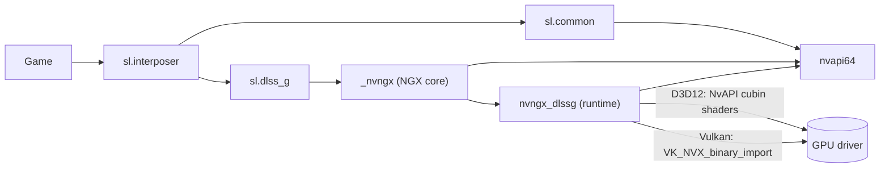
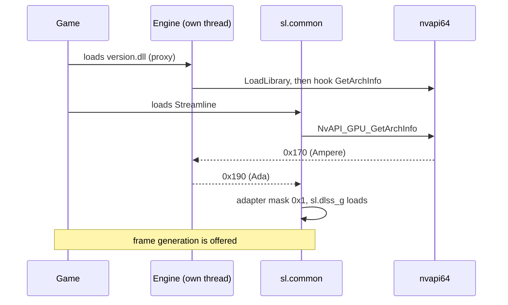
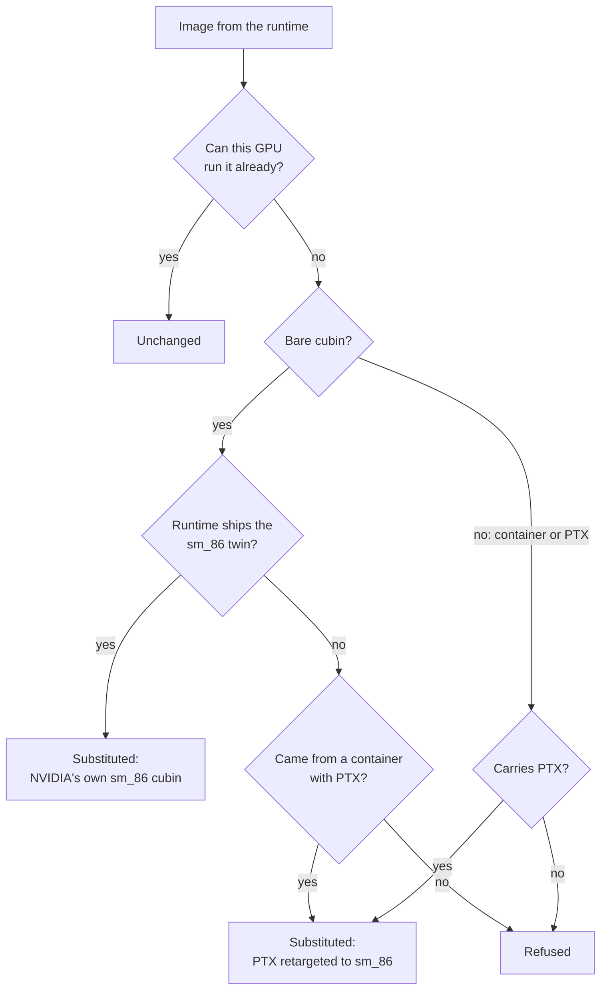

# How opendlssg-fg works

This project enables NVIDIA's DLSS Frame Generation on RTX 30. It does not
implement frame generation: every generated frame is produced by the game's own
copy of NVIDIA's DLSS-G runtime, by the same code an RTX 40 would run. What
follows is only about the restrictions that stop that code running on an older
card.

DLSS Frame Generation (DLSS-G) runs on RTX 40 and 50 cards. NVIDIA withholds it
from RTX 30 in two ways, and both have to be undone before a single frame is
generated:

1. **The software stack refuses to offer it.** Several components compare the
   GPU's architecture against Ada and switch the feature off when it is older.
2. **The runtime has no kernels an RTX 30 can execute.** DLSS-G is a set of CUDA
   kernels, and the ones NVIDIA hands to the driver are built for Ada only.

This document explains what each component does, where the engine intervenes,
what it changes, and why each change is safe.

- [The components](#the-components)
- [What is changed, and where](#what-is-changed-and-where)
- [Startup: opening the gates in time](#startup-opening-the-gates-in-time)
- [Gate 1: the adapter mask](#gate-1-the-adapter-mask)
- [Gate 2: the availability check](#gate-2-the-availability-check)
- [Gate 3: frame pacing](#gate-3-frame-pacing)
- [Gate 4: kernels](#gate-4-kernels)
- [Scope and safety](#scope-and-safety)
- [Diagnosing a problem](#diagnosing-a-problem)
- [Source map](#source-map)

## The components

A DLSS-G game ships NVIDIA's Streamline integration and the DLSS-G runtime. The
driver supplies NVAPI, the NGX core and CUDA.

| Component | File | Ships with | Role |
|---|---|---|---|
| Streamline interposer | `sl.interposer.dll` | game | Entry point the game calls; loads plugins |
| Streamline common | `sl.common.dll` | game | Reads system capabilities, decides which plugins run |
| DLSS-G plugin | `sl.dlss_g.dll` | game | Streamline's wrapper around frame generation; paces output |
| DLSS-G runtime | `nvngx_dlssg.dll` | game | NVIDIA's frame generation itself: the CUDA kernels |
| NGX core | `_nvngx.dll` | driver | Loads NGX runtimes and answers capability queries |
| NVAPI | `nvapi64.dll` | driver | Driver API; reports the GPU architecture |
| CUDA driver | `nvcuda.dll` | driver | Compiles and runs kernels |



The engine is a DLL the game already loads by name (`version.dll`, `winmm.dll`,
`dinput8.dll` or `dxgi.dll`). It forwards every export to the real system DLL, so
the game behaves normally, and from there hooks the handful of functions listed
below.

## What is changed, and where

Nothing on disk is modified. Every change is made in memory, in the game's own
process, and only on a GPU that needs it.

| # | Where | What is changed | Why |
|---|---|---|---|
| 1 | `nvapi64` `NvAPI_GPU_GetArchInfo` | Answers Ada instead of Ampere, to three named callers only | Opens gates 1 and 2 |
| 2 | `nvapi64` `NvAPI_D3D12_SetRawScgPriority` | Answered with success, not executed | An Ada-only call that removes the device on older hardware |
| 3 | `sl.dlss_g` flip-metering flag writes | Forced to the plugin's own software-pacing value | Gate 3: Ampere has no hardware flip metering |
| 3b | `nvngx_dlssg` comparisons against the Blackwell id | Compare against Ada instead | [Multi-frame](#multi-frame-generation): 3x and above |
| 4 | `nvapi64` `NvAPI_D3D12_CreateCubinComputeShaderExV2` | Kernel image replaced | Gate 4, Direct3D 12, one cubin at a time |
| 4b | `nvapi64` `NvAPI_D3D12_CreateCuModule` | Fatbin replaced | Gate 4, Direct3D 12, runtimes from 310.7 |
| 5 | Vulkan loader `vkGetDeviceProcAddr` and `vkGetInstanceProcAddr` | Hand out a wrapper for `vkCreateCuModuleNVX` | Gate 4, Vulkan route |
| 6 | `kernel32` `LoadLibraryExW` | Wakes the engine's worker when a library loads; applies 3b inside the runtime's load | Timing |
| 7 | `sl.interposer` exports | Observed and logged | Diagnostics; see [below](#diagnosing-a-problem) |

Optional and off by default: lifting the plugin's frame-count clamp
(`PatchFrameClamp`), forcing a multiplier (`ForceMultiplier`), and loading a
different runtime (`[Runtime] Mode=Bundled`). A redirected runtime runs under
the file name it was configured as, so that name joins the callers told Ada;
without it the runtime is told the truth and creates no kernels.

## Startup: opening the gates in time

Streamline reads the GPU architecture **once**, within the first hundred
milliseconds of its startup, and every later decision compares against that
record. A hook installed after that moment has no effect, however correct it is.

`nvapi64.dll` usually arrives as a static import of `sl.common.dll`, so it never
passes through `LoadLibrary` under its own name. The engine therefore maps
`nvapi64.dll` itself, early, on its own thread, and hooks it there. Whoever loads
it afterwards receives a module that is already hooked.



Two rules keep installation safe:

- **No hook is installed under the loader lock.** Installing an inline hook
  briefly suspends every other thread; doing that while a thread is inside
  `LoadLibrary` can deadlock it. The `LoadLibraryExW` hook only wakes a worker
  thread, and the worker does the rest.
- **The original function is published before the hook goes live.** Otherwise a
  thread arriving in between reaches a hook with nothing to call through to. On
  `LoadLibraryExW` that fails a DLL load the game asked for. `hooks::Install` is
  the only way the engine installs a hook, and it always publishes first.

## Gate 1: the adapter mask

`sl.common` records each adapter's architecture, then computes, for every plugin,
a mask of the adapters it may run on:

```
adapters[i].architecture >= info.minGPUArchitecture
```

For DLSS-G the minimum is Ada, `0x190`. With the real value, Ampere `0x170`, the
mask is empty, the plugin is dropped, and the game never offers the option:

```
getSystemCaps] Adapter 0 architecture 0x170
mapPlugins] Loaded plugin 'sl.dlss_g' - adapter mask 0x0
loadPlugins] Ignoring plugin 'sl.dlss_g' since it is not supported on this platform
```

With the answer rewritten:

```
getSystemCaps] Adapter 0 architecture 0x190
mapPlugins] Loaded plugin 'sl.dlss_g' - adapter mask 0x1
```

### Who is told, and who must not be

The rewrite is scoped by caller, identified from the return address. Three
modules are told Ada; everything else, **including the game**, sees the real
hardware.

| Caller | Told | Reason |
|---|---|---|
| `sl.common.dll` | Ada | Computes the adapter mask (gate 1) |
| `_nvngx.dll` | Ada | Answers the availability query (gate 2) |
| `nvngx_dlssg.dll` | Ada | The runtime; does not create its kernels otherwise |
| the game, `sl.interposer`, `nvngx_dlss`, `nvngx_dlssd` | real | See below |

A caller is identified by the component it is, not by the file name it carries.
NGX keeps downloaded copies of Streamline plugins and feature runtimes in
`%ProgramData%\NVIDIA\NGX\models\<component>\versions\<build>\files`, named
`<architecture>_<application id>.dll`, and Streamline loads one in preference to
the copy a game ships. In Halo Campaign Evolved the downloaded `sl.common` was
the only one that ran, so matching on file names alone left the caller that
computes the adapter mask unscoped, it read Ampere, and every DLSS-G plugin was
disabled before the game could offer the option. `paths::ComponentFileName` maps
such a path back to the module the component ships as. The same rule finds the
frame-generation runtime itself, which NGX stores under that scheme with a
`.bin` extension; looking for the file name `nvngx_dlssg.dll` misses it, and
then neither its multi-frame gates nor its kernels are handled.

Scoping is not a refinement. In PRAGMATA with path tracing on, telling every
caller Ada removed the device before the main menu (`DXGI_ERROR_DEVICE_REMOVED`),
with nothing in any log pointing at frame generation; telling only these three
does not. The game itself never asked in either tested title. The callers that
did, and were told Ada only in the failing case, are the upscaling runtimes (DLSS
Super Resolution and Ray Reconstruction), which pick architecture-specific code
paths from the answer.

## Gate 2: the availability check

With the plugin loaded, its startup asks the NGX core whether DLSS-G is
available. The NGX core checks the architecture on its own, which is why
`_nvngx.dll` is on the list above. Without it:

```
dlss_gEntry.cpp [slOnPluginStartup] NGX indicates DLSS-G is not available - DLSS-G cannot run
```

With it, the plugin starts and the game can switch frame generation on:

```
dlss_gEntry.cpp [slOnPluginStartup] Multi-frame supported, max generated frames 3 (NGX feature supports 1)
dlss_gEntry.cpp [slSetData] slDLSSGSetOptions() is called
```

`NGX feature supports 1` is the runtime's own limit: it offers more than one
generated frame only on Blackwell. See [multi-frame generation](#multi-frame-generation).

## Gate 3: frame pacing

Ada and newer pace generated frames with hardware flip metering. Ampere has none.
Because the plugin believes it is on Ada, it would choose hardware metering, and
the generated frames would never be shown.

The plugin already carries a software fallback. It takes it when it detects an
older frame-generation runtime: right after logging `FG1 DLL has been detected`,
it writes its metering flag to the off state. The engine finds that log string,
finds the code that references it, and reads the write that follows. That gives
the flag's offset and its off value, which change from one plugin build to the
next:

| Game | Plugin write after the marker | Flag | Off value |
|---|---|---|---|
| PRAGMATA | `mov byte ptr [rbx+0x38bc], 0` | `0x38bc` | 0 |
| DOOM The Dark Ages | `mov byte ptr [rbx+0x44a0], 1` | `0x44a0` | 1 |

Every other write of the opposite value to that flag is then changed to match, so
the plugin always takes its own software path. Copying the plugin's own value,
instead of assuming one, is what makes this work across builds. On Vulkan the
flag has no effect, since flip metering is a Direct3D 12 feature.

The code is found with signatures, not addresses. libhat matches the
`lea reg, [rip+marker]` that references the string, HDE64 (MinHook's decoder)
walks the instructions after it to the first byte store, and a second signature
built from that store finds the opposite writes. `patchprobe` prints the result
for any `sl.dlss_g.dll` without running a game, which is the first thing to check
on a new plugin build.

Every mapped copy of the plugin is patched, the game's and any NGX downloaded,
and each is pinned before it is read. Streamline can unload the copy it did not
choose, and a scan of an image that is unmapped underneath it would fault in the
game. A plugin that cannot be pinned is left alone, logged as
`plugin_pin_failed`.

## Gate 4: kernels

### Why nothing can run

The runtime stores its kernels in two forms and picks among them by the
architecture it believes it is on. Reading `nvngx_dlssg.dll` 310.3 and 310.6:

| Form | Where | Architectures |
|---|---|---|
| Fatbin containers | inside the runtime | PTX `sm_89`, PTX `sm_120`, some cubin `sm_89` |
| Standalone cubins | beside the containers | 39 `sm_89` and **39 `sm_86`** |

The runtime has to believe it is on Ada to offer frame generation at all, so it
always picks the `sm_89` images. None of them run on an RTX 30 (`sm_86`):

- **PTX** is portable intermediate code that the driver compiles on load, but
  only for the architecture it names **or newer**. `sm_89` PTX cannot be compiled
  for `sm_86`.
- **A cubin** is finished machine code. It runs only within its own major
  version, on the same or a newer minor: an `sm_80` cubin runs on `sm_86`, an
  `sm_89` one does not.

On Direct3D 12 the driver refuses such an image. On Vulkan it accepts it, and the
GPU hangs when the kernel runs.

### What the engine supplies

Every kernel image the runtime creates passes through `kernels::Decide`, which
returns one of three answers:



**Native images first.** The 39 standalone `sm_86` cubins are NVIDIA's own Ampere
builds of the same kernels. The runtime chooses by the architecture it believes it
is on, and it has been told Ada, so it passes the `sm_89` build instead. The
engine puts the `sm_86` one back, unchanged.

Matching must be exact. A kernel such as `k_conv_fp16_nhwc` has several variants
that differ only in tile shape, and launching the wrong one hangs the GPU. The
variants are stored in a different order for each architecture, so position
means nothing. What identifies a variant is its machine code: NVIDIA's `sm_86` and
`sm_89` builds of one variant carry **byte-identical code** and differ only in
metadata, while two variants differ in code. Images are therefore paired by
kernel name and a hash of the kernel's code section. In both runtimes tested this
pairs 39 of 39, each to exactly one image.

**Retargeted PTX otherwise.** A container's PTX is rebuilt with its `.target`
directive and the container's architecture field set to `sm_86`, and the driver
compiles it on load. Nothing else in the PTX changes, and nothing needs to: the
kernels use `mma.sync.m16n8k16` and `ldmatrix`, both native to Ampere, no FP8 or
newer instructions, and at most 13.8 KB of static shared memory. `tools/ptxprobe`
checks this against the installed driver; all 72 PTX modules of a 310.3 runtime
compile.

**Refused when neither applies.** The creation fails, which the runtime handles,
instead of the driver receiving code it cannot run. If the driver refuses a
substituted image, that refusal is returned too; the original is never retried,
because it is by construction unrunnable.

Nothing is shipped or stored. Both kinds of replacement come from the runtime the
game already has, so a runtime version this project has never seen is handled the
same way as a known one.

**Each runtime answers only for itself.** More than one DLSS-G runtime can be
mapped at once. A driver profile with *DLSS Override* enabled, which the NVIDIA
app and NVIDIA Profile Inspector both set, makes NGX load a runtime of its own
from `%ProgramData%\NVIDIA\NGX\models\dlssg\versions\<build>\files`, named
`<architecture>_<application id>.bin`, and use it instead of the one the game
ships. So the engine indexes every runtime it sees and answers a kernel from the
build that created it, never from another one. The native images of two builds
are not interchangeable even when the kernels look the same: in Crimson Desert,
answering a 310.9.0 runtime's kernels from a 310.9.1 index had the driver refuse
all 25 of them with `NVAPI_INVALID_IMAGE`, and Streamline's `sl.dlssg` worker
then timed out and took the game with it. An unindexed runtime is refused rather
than answered wrongly, which `kernel_refused` states as `this runtime was not
indexed`.

A runtime is pinned as soon as it is found, before anything reads it. The index
points into the mapped image and the gate scan reads the code section directly,
while NGX unloads a runtime it has replaced; without the pin, either read can
land on an image that is no longer there. A runtime that cannot be pinned is not
indexed at all.

### Two routes to the driver

| API | Entry point | How it is reached |
|---|---|---|
| Direct3D 12 | `NvAPI_D3D12_CreateCubinComputeShaderExV2` | Inline hook on the function |
| Direct3D 12, from 310.7 | `NvAPI_D3D12_CreateCuModule` | Inline hook on the function |
| Vulkan | `vkCreateCuModuleNVX` (`VK_NVX_binary_import`) | Wrapper returned by the loader's `vkGet*ProcAddr` |

The NVAPI parameter block is versioned and not public. The engine finds the image
inside it by searching for a pointer to a fatbin container and a field holding the
length that container states for itself; both have to agree. The first calls the
runtime makes are probes that carry no container, so the search is retried until
one does:

```
cubin_params_located struct_size=0x50 data_offset=0x18 size_offset=0x20 name_offset=0x38
```

The Vulkan extension function is exported by nobody; the loader hands it out,
so that is where the engine takes it over. Both of the loader's resolvers are
hooked, because `vkGetInstanceProcAddr` also answers for a device function,
with a trampoline that dispatches through the device. A resolution through an
unhooked one would reach the driver with an image this GPU cannot run.

A cubin's length is read from its ELF header and includes the program headers,
which follow the section table. Stopping at the section table hands the driver a
truncated module.

## Multi-frame generation

The runtime decides how many frames it may generate by comparing the
architecture it was told against Blackwell's id, 0x1B0. It does so where it
publishes `DLSSG.MultiFrameCountMax` and again where it validates the count a
game asks for:

```
cmp  esi, 0x1B0        ; 310.6
mov  r8d, 5
cmovl r8d, ebx         ; ebx = 1: below Blackwell, one frame
lea  rdx, "DLSSG.MultiFrameCountMax"
```

`MultiFrame=1` rewrites these comparisons to Ada's id, the architecture the
runtime has been told, as it is loaded and before any of its code runs. The
plugin's startup line then reports `NGX feature supports 3` (310.3), or 5 from
310.6 onwards, and a game that supports multi-frame generation offers the
multipliers its own plugin allows: 4x with a plugin capped at 3 generated
frames, 6x with one that allows 5, which Crimson Desert reaches. RTX40MFG-Unlock and
mfg-unlock make the same change on RTX 40 cards.

**Which comparisons are gates.** Not every comparison against that id is one,
and the shape of a gate is not stable: 310.6 compiles it to `cmovl` where 310.7
uses `jl`, so a byte pattern finds one site and misses the other. What does hold
is the meaning. A gate gives the feature to every architecture at or above an
id, so the instruction that reads it is an ordering test: `jl`, `jb`, `setae`,
`cmovl`. A comparison read for equality is asking whether the GPU is one exact
architecture, and moving the id would change that question rather than answer it
differently, so it is refused. The reader is always the instruction directly
after the comparison, where no other instruction can have changed the flags.

Two further rules keep an unknown build safe. A comparison whose result is
published as some other `DLSSG.` parameter belongs to another capability and is
left alone, logged as `multi_frame_gate_left` naming the parameter, which is how
`DLSSG.ReflexWarp.Available` survives in 310.3. And if
a build yields more than four comparisons, or none read as an ordering, nothing
is rewritten and `multi_frame_gates_not_found` says so. Runtimes from 310.7 put
a driver-profile clamp between the comparison and the publication, which is why
the parameter name is no longer what identifies a gate.

This rule is mfg-unlock's, from its analysis of 310.6 through 310.8.
`patchprobe` shows the classification for any runtime.

The gates are moved only once NVAPI has reported an Ampere GPU. On Ada the
multi-frame decision is NVIDIA's to keep, and moving it would switch on paths
whose kernels Ada does not have. A runtime that loads before the GPU has been
identified is patched on the next module scan instead, logged as
`multi_frame_deferred`.

A game that only switches frame generation on and off never asks for more than
one generated frame, whatever the runtime allows. `ForceMultiplier` replaces the
count in `slDLSSGSetOptions` for those; Far Far West runs at 4x that way.

The kernels need a matching change. The Ada build of the motion-vector kernel
places every generated frame at the midpoint, a constant 0.5 used 104 times; the
Blackwell build reads the frame's position from its parameters. At 3x and above
the Ada build would stack the generated frames on top of each other. With
`MultiFrame=1`, containers are therefore retargeted from their newest PTX
(`sm_120`), provided its entry points, parameters, launch bounds and shared
memory are identical to the Ada build's, so the runtime's launch means the same
to it. In 310.3 and 310.6 all 31 kernels that ship both builds match, and all
compile for `sm_86` (`ptxprobe <runtime> 0 newest`). If the driver rejects one,
it is rebuilt from the Ada PTX and tried once more (`kernel_fallback` in the
log), so a future runtime whose Blackwell PTX does not fit costs 3x and above,
not frame generation.

## Scope and safety

**Ampere (RTX 30) only.** The engine acts only after NVAPI reports an Ampere GPU.
On any other GPU its hooks pass every call through unchanged.

- **RTX 40 and 50** run DLSS-G natively. Every image they are handed is already
  runnable, so nothing would change, and the plugin patches are not applied.
- **RTX 20 (Turing) is not supported yet.** The kernels use `mma.m16n8k16`, which
  PTX requires `sm_80` for, and the runtime ships no `sm_75` cubins. Supplying
  Turing kernels needs the PTX rewritten to Turing's smaller matrix instructions.
  Until that exists, Turing cards are left untouched rather than offered a
  feature that cannot run.

**Fails closed.** A patch that cannot find its exact pattern is skipped and
logged. A hook that cannot be installed is reported with MinHook's status and not
retried in a loop. A kernel image that cannot be made runnable is refused.

**Quits cleanly.** When the process exits, Windows has already stopped every other
thread, possibly while one held a lock the engine would take. The engine does
nothing on that path.

## Diagnosing a problem

Logs are written to `opendlssg\logs\` beside the proxy DLL, one JSON object per
line, one file per process, newest ten kept. They are meant to be attached to a
bug report, so every path is logged through `log::Field::Path`, which writes the
user's profile directory as `%USERPROFILE%` rather than carrying an account name
into a public issue.

`[Logging] Level` selects how much is kept: 1 errors and warnings, 2 decisions
and capabilities as well, 3 everything, including a line per call a game makes.
Level 1 is the default and the right level for a report, because the lines that
identify a run are written at every level: `attach`, `configuration`, `driver`,
`gpu_architecture`, `arch_spoof_applied`, `provider_found` and
`kernels_summary`. A step that merely confirms health, such as `proxy_bound`,
is written at level 2; its failing form is an error or a warning, so level 1
still shows anything that went wrong.

An **error** means the engine failed at something it set out to do, and frame
generation is worse or absent for it. A **warning** means it carried on, and
covers every deliberate refusal: an unknown runtime version, a plugin whose
pacing patch found nothing to change, a multiplier the runtime would not take.
Warnings are expected in healthy runs on newer plugins and are not failures.

| Question | Look for |
|---|---|
| Did the engine load? | `attach`, `configuration`, `proxy_bound` with `resolved` equal to `total` |
| Were settings ignored? | `config_value_rejected` |
| Is this GPU enabled? | `gpu_architecture` with `supported: true` |
| Did the spoof land in time? | `arch_spoof_applied`, then Streamline's `adapter mask 0x1` |
| Is frame generation on? | `dlssg_set_options` with `mode: on`, `dlssg_state` with `presented: 2` |
| Which runtime is in play? | The `caller` of `kernel_substituted`. `provider_found` is written once per runtime mapped, and more than one is normal |
| Were kernels supplied? | `kernel_substituted` with `method: native` or `retarget` |
| Were kernels supplied at all? | `kernels_summary`, written once the count settles |
| Is the OS in the way? | `hardware_scheduling` with `enabled: false` |
| Which driver was this? | `driver`, or `driver_version_unavailable` when NVAPI would not answer |
| Why is a hook missing? | `hook_export_missing`, or `nvapi_interface_absent` when the installed driver does not publish that entry point, which an older driver legitimately may not |
| Did anything fail? | `hook_failed`, `kernel_refused`, `kernel_driver_rejected`, `runtime_redirect_missing` |

**More than one runtime.** A process can map several DLSS-G runtimes: the one the
game ships, one NGX downloaded for a driver profile with the DLSS override
enabled, and the driver's own fallback copy. Each gets its own `provider_found`,
`multi_frame_unlocked` and `provider_index_built`, named by path. The one
generating frames is the one named as the `caller` of `kernel_substituted`; the
others are read and put aside, so a `multi_frame_gates_not_found` against one of
them is not a failure of the run.

Two refusals say the opposite, and they are different problems.
`this runtime was not indexed` means kernels arrived from a runtime the loader
never found, and `caller` names it. `the calling module could not be identified`
means the return address belonged to no module at all, which happens when
another tool has hooked the same entry point and calls through a trampoline of
its own. That one is only ever refused while several runtimes are indexed: with
one there is nothing to confuse it with, so it is answered from that one, which
is what a single-runtime process did before any of this existed. No tool tested
against so far interposes on these entry points, so this is a guard rather than
a path anything is known to take.

`provider_pin_failed` means a runtime was found and then could not be kept
mapped, so it was left alone rather than indexed from an image that may be
unmapped underneath it.

**Streamline's reasoning.** Streamline states why it accepts or refuses a feature
in its own log and nowhere else. A production interposer ignores its JSON
override, so `[Debug] StreamlineDiagnostics=1` sets `SL_LOG_LEVEL` and
`SL_LOG_PATH` before Streamline starts; its log appears as `sl.log` next to ours.

**Black screen or freeze.** This is usually a GPU hang, not a stalled wait.
Windows records each one in the System event log: provider `nvlddmkm`, message
`Restarting TDR occurred`. That entry is what distinguishes the two.

**Vulkan hook unavailable.** `vulkan_hooks_unavailable` means the Vulkan loader
was loaded and one of its resolvers could not be hooked, named by
`device_resolver` and `instance_resolver`. Many Direct3D 12
games load the loader only to probe for Vulkan and unload it again; the engine
holds a reference while it hooks, and a loader that is already gone is simply
tried again later, so that probe is not an error. Direct3D 12 games are
unaffected either way. In a Vulkan game, frame generation will have no kernels
it can run.

## Source map

| Path | Responsibility |
|---|---|
| `src/dllmain.cpp` | Entry point: binds forwarded exports, starts initialization |
| `src/proxy` | Forwards the system DLL's exports; stubs generated by `tools/gen_proxy.py` |
| `src/app` | Settings, startup, module discovery (`loader.cpp`) |
| `src/core` | Logging, INI, UTF-8, PE helpers, x86 decoding, the hook installer |
| `src/spoof` | NVAPI: the architecture answer, the priority stub, the D3D12 kernel route |
| `src/streamline` | Interposer diagnostics, plugin patches |
| `src/kernels` | Kernel decisions, fatbin and cubin handling, native cubin index, Vulkan route |
| `src/provider` | Identifies the runtime and its version; the multi-frame gates |
| `tests` | Unit tests for the pure logic |
| `tools/ptxprobe` | Checks a runtime's kernels against the installed driver, without a game |
| `tools/patchprobe` | Reports what the patches would change in an `sl.dlss_g.dll` or `nvngx_dlssg.dll`, and a runtime's kernel index, without a game |
