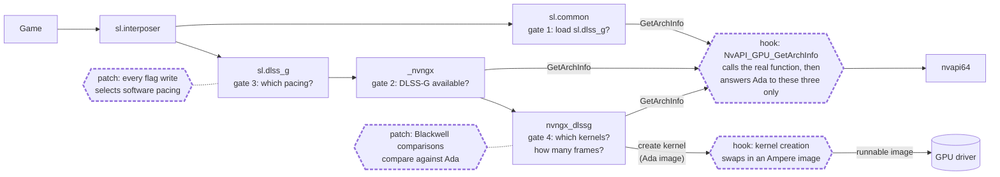
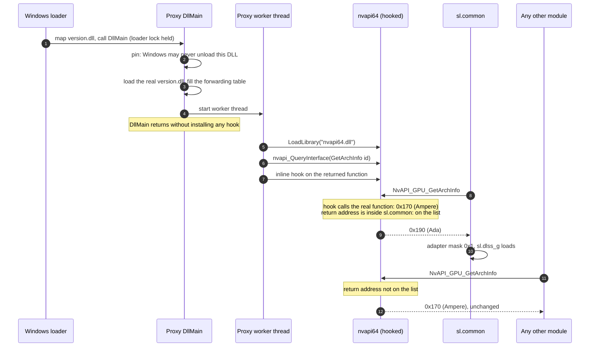
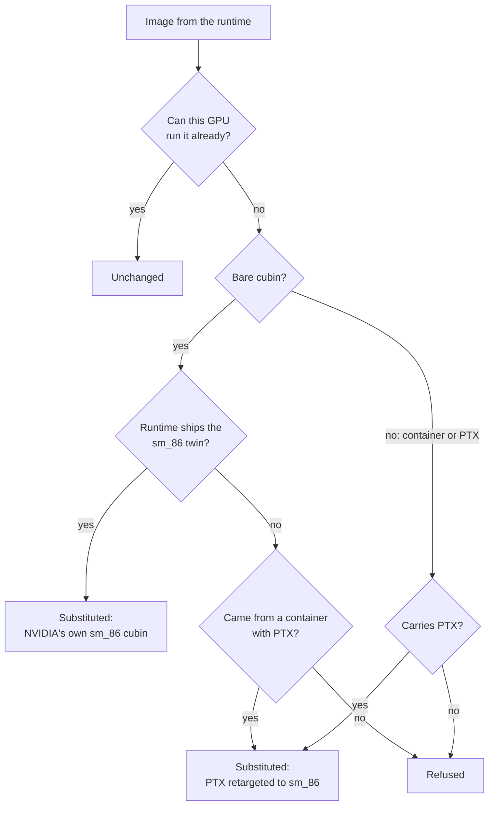
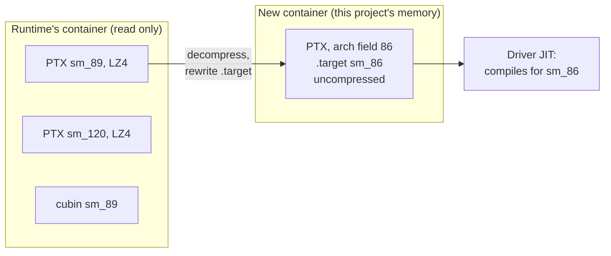
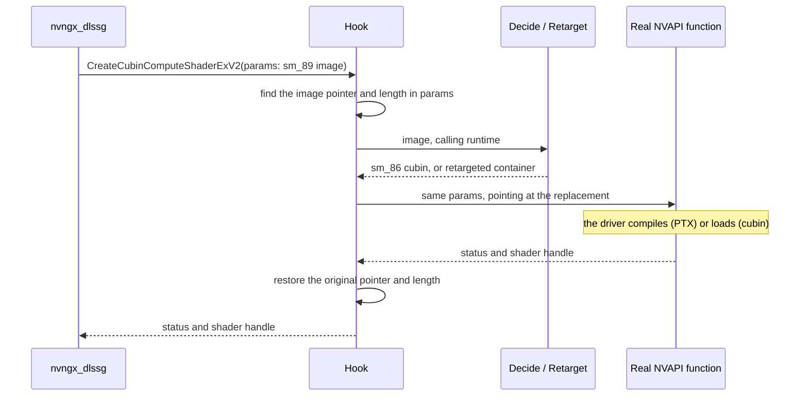

# How opendlssg-fg works

opendlssg-fg enables DLSS Frame Generation (DLSS-G) on RTX 30. It does not
generate frames itself: the game's own copy of NVIDIA's DLSS-G runtime does,
running the same code as on RTX 40. This project removes the two things that
stop that code running on Ampere:

1. **The software refuses to offer it.** Several components compare the GPU
   architecture against Ada and turn the feature off below it.
2. **The runtime has no kernels Ampere can run.** DLSS-G is a set of CUDA
   kernels, and the ones it hands to the driver are built for Ada.

- [The components](#the-components)
- [What is changed, and where](#what-is-changed-and-where)
- [Startup: opening the gates in time](#startup-opening-the-gates-in-time)
- [Gate 1: the adapter mask](#gate-1-the-adapter-mask)
- [Gate 2: the availability check](#gate-2-the-availability-check)
- [Gate 3: frame pacing](#gate-3-frame-pacing)
- [Gate 4: kernels](#gate-4-kernels)
- [Multi-frame generation](#multi-frame-generation)
- [Scope and safety](#scope-and-safety)
- [Diagnosing a problem](#diagnosing-a-problem)
- [Source map](#source-map)

## The components

The game ships Streamline and the DLSS-G runtime. The driver supplies NVAPI,
the NGX core and CUDA. Each component makes its own decision about the GPU,
which is why there are several gates rather than one.

| Component | File | Ships with | Responsible for | Decides, from the GPU architecture |
|---|---|---|---|---|
| Streamline interposer | `sl.interposer.dll` | game | The API the game calls; loads plugins | Nothing |
| Streamline common | `sl.common.dll` | game | Reads system capabilities | Which plugins may load (gate 1) |
| DLSS-G plugin | `sl.dlss_g.dll` | game | Streamline's wrapper around frame generation; presents and paces frames | Hardware or software pacing (gate 3) |
| NGX core | `_nvngx.dll` | driver | Loads NGX runtimes, answers capability queries | Whether DLSS-G is available (gate 2) |
| DLSS-G runtime | `nvngx_dlssg.dll` | game | Frame generation itself: a set of CUDA kernels | Which kernel builds to use (gate 4); how many frames (multi-frame) |
| NVAPI | `nvapi64.dll` | driver | Driver API; reports the architecture; creates CUDA kernels under Direct3D 12 | Nothing; it is the source of the answer |
| CUDA driver | `nvcuda.dll` | driver | Compiles and runs kernels | Nothing |

The project is a DLL the game already loads by name (`version.dll`,
`winmm.dll`, `dinput8.dll` or `dxgi.dll`). It forwards every export to the real
system DLL, so the game works normally, and changes the game's process in the
places below.

## What is changed, and where

Nothing on disk is modified. All changes are in memory, in the game's process,
and only on Ampere. Dashed boxes are this project; everything else is NVIDIA's.



Read it left to right. The fake architecture opens gates 1 and 2, and makes the
runtime run at all. But telling the plugin and the runtime they are on Ada also
makes them choose Ada-only paths, so each of those choices is corrected where it
is made: the pacing flag, and the kernels handed to the driver.

| # | Where | Change | Why |
|---|---|---|---|
| 1 | `nvapi64` `NvAPI_GPU_GetArchInfo` | Returns Ada instead of Ampere, to three callers only | Gates 1 and 2 |
| 2 | `nvapi64` `NvAPI_D3D12_SetRawScgPriority` | Returns success without running | Ada-only call that removes the device on older GPUs |
| 3 | `sl.dlss_g` flip-metering flag writes | Set to the plugin's software-pacing value | Gate 3: Ampere has no hardware flip metering |
| 3b | `nvngx_dlssg` comparisons against the Blackwell id | Compare against Ada instead | [Multi-frame](#multi-frame-generation): 3x and above |
| 4 | `nvapi64` `NvAPI_D3D12_CreateCubinComputeShaderExV2` | Kernel image replaced | Gate 4, Direct3D 12, one cubin at a time |
| 4b | `nvapi64` `NvAPI_D3D12_CreateCuModule` | Fatbin replaced | Gate 4, Direct3D 12, runtimes from 310.7 |
| 5 | Vulkan loader `vkGetDeviceProcAddr` and `vkGetInstanceProcAddr` | Return a wrapper for `vkCreateCuModuleNVX` | Gate 4, Vulkan |
| 6 | `kernel32` `LoadLibraryExW` | Wakes the worker thread on each load; applies 3b while the runtime loads | Timing |
| 7 | `sl.interposer` exports | Logged only | [Diagnostics](#diagnosing-a-problem) |

Two kinds of change are used. A **hook** redirects a function to this project's
code, which usually calls the original and adjusts its inputs or result
(MinHook inline hooks). A **patch** rewrites a few instruction bytes inside
NVIDIA's code, found by signature, so that code makes a different choice.

Off by default: lifting the plugin's frame-count clamp (`PatchFrameClamp`),
forcing a multiplier (`ForceMultiplier`), and loading a different runtime
(`[Runtime] Mode=Bundled`). A redirected runtime runs under its configured file
name, so that name is added to the callers told Ada.

## Startup: opening the gates in time

Streamline reads the GPU architecture once, in the first hundred milliseconds,
and uses that value from then on. A hook installed later has no effect.

NVAPI exports a single function, `nvapi_QueryInterface`, which returns the
address of any other NVAPI function from a numeric id. `nvapi64.dll` is usually
a static import of `sl.common.dll`, so it never goes through `LoadLibrary` by
name. The project therefore loads `nvapi64.dll` itself, early, on its own
thread, asks it for `NvAPI_GPU_GetArchInfo`, and hooks that function in place.
Every caller, whenever it resolved the function, then goes through the hook.



What `DllMain` does, step by step:

- **Pin.** `GetModuleHandleExW` with `GET_MODULE_HANDLE_EX_FLAG_PIN` makes the
  proxy impossible to unload. Hooks keep pointing into its code for the rest of
  the process, so a game that calls `FreeLibrary` on it must not unmap it.
- **Fill the forwarding table.** Every export of the proxy is a small stub that
  jumps through a table entry (generated by `tools/gen_proxy.py`). `DllMain`
  loads the real system DLL from `System32` and writes the address of each of
  its functions into the table, before the game can call any of them. After
  that the game's calls to `version.dll` reach the real one.
- **Hand off.** Everything else runs on the worker thread, because `DllMain`
  runs under the loader lock (see the rules below).

The worker then watches for NVIDIA's modules for the rest of the process. It
lists the loaded modules when the `LoadLibraryExW` hook wakes it, and once a
second otherwise, because a module loaded as a static import never passes
through `LoadLibraryExW`. Each pass is a *module scan*: any new NVIDIA
component it finds is identified, pinned and patched or hooked.

The caller of `GetArchInfo` is identified by the module that contains the
hook's return address, mapped back to the component it is (see
[who is told](#who-is-told-and-who-must-not-be)).

Two rules for installing hooks:

- **No inline hook under the loader lock.** The loader lock is the process-wide
  lock Windows holds while it loads a DLL and runs its `DllMain`. Installing an
  inline hook briefly suspends every other thread; if one of them is waiting on
  that lock, or holds it, the process can deadlock. So `DllMain` and the
  `LoadLibraryExW` hook only start or wake the worker thread, which installs
  hooks outside the lock.
- **Publish the trampoline before enabling the hook.** An inline hook overwrites
  the start of the target function with a jump to our code. The overwritten
  instructions are moved into a *trampoline*, which our code calls to run the
  original function. Its address must be stored before the jump goes live, or a
  thread arriving in between reaches our code with nothing to call; on
  `LoadLibraryExW` that fails a load the game asked for. `hooks::Install`
  always does this in order.

## Gate 1: the adapter mask

`sl.common` records each adapter's architecture and computes, per plugin, a mask
of adapters it may run on:

```
adapters[i].architecture >= info.minGPUArchitecture
```

DLSS-G requires Ada, `0x190`. With Ampere's real `0x170` the mask is empty and
the plugin is dropped:

```
getSystemCaps] Adapter 0 architecture 0x170
mapPlugins] Loaded plugin 'sl.dlss_g' - adapter mask 0x0
loadPlugins] Ignoring plugin 'sl.dlss_g' since it is not supported on this platform
```

With the spoof:

```
getSystemCaps] Adapter 0 architecture 0x190
mapPlugins] Loaded plugin 'sl.dlss_g' - adapter mask 0x1
```

### Who is told, and who must not be

The caller is identified from the return address. Three modules are told Ada;
everything else, including the game, sees the real GPU.

| Caller | Told | Reason |
|---|---|---|
| `sl.common.dll` | Ada | Computes the adapter mask (gate 1) |
| `_nvngx.dll` | Ada | Answers the availability query (gate 2) |
| `nvngx_dlssg.dll` | Ada | The runtime; creates no kernels otherwise |
| the game, `sl.interposer`, `nvngx_dlss`, `nvngx_dlssd` | real | See below |

Callers are matched by component, not file name. NGX downloads replacement
plugins and runtimes to
`%ProgramData%\NVIDIA\NGX\models\<component>\versions\<build>\files` as
`<architecture>_<application id>.dll` (`.bin` for runtimes), and Streamline
prefers them over the game's copies. In Halo Campaign Evolved only the
downloaded `sl.common` ran; matching by file name missed it and the plugin was
disabled. `paths::ComponentFileName` maps such a path back to the component's
module name.

The scope matters. In PRAGMATA with path tracing on, telling every caller Ada
removed the device before the main menu (`DXGI_ERROR_DEVICE_REMOVED`). The
only extra callers in that run were the DLSS Super Resolution and Ray
Reconstruction runtimes, which choose architecture-specific code from the
answer.

## Gate 2: the availability check

At startup the plugin asks the NGX core whether DLSS-G is available, and the NGX
core checks the architecture itself. Without `_nvngx.dll` on the list:

```
dlss_gEntry.cpp [slOnPluginStartup] NGX indicates DLSS-G is not available - DLSS-G cannot run
```

With it:

```
dlss_gEntry.cpp [slOnPluginStartup] Multi-frame supported, max generated frames 3 (NGX feature supports 1)
dlss_gEntry.cpp [slSetData] slDLSSGSetOptions() is called
```

`NGX feature supports 1` is the runtime's own limit; see
[multi-frame generation](#multi-frame-generation).

## Gate 3: frame pacing

**The problem.** With frame generation, the game renders one frame and the
runtime adds one or more generated frames between it and the previous one.
They only look smooth if they are shown at even intervals. That timing is
called *pacing*.

The plugin can pace in two ways:

- **Hardware flip metering.** The plugin queues the frames with target times,
  and the GPU's display hardware shows ("flips") each one at its time. Newer
  GPUs have this; Ampere does not.
- **Software pacing.** The plugin times the presents itself on the CPU. This
  works on any GPU.

The plugin chooses by the GPU it believes it is on. Told Ada, it picks hardware
metering, which Ampere cannot do: under Direct3D 12 the generated frames are
never shown. On Vulkan the flag has no effect.

**The fix.** The plugin already contains the software path. It takes it when it
detects an older frame-generation runtime: right after logging
`FG1 DLL has been detected`, it stores a byte to a flag in its context
structure, and that value means "no hardware metering". The project reuses that
decision everywhere:

1. Find the string `FG1 DLL has been detected` in the plugin.
2. Find the instruction that loads its address (`lea reg, [rip+string]`),
   using libhat.
3. Decode forward with HDE64 to the first byte store after it, for example
   `mov byte ptr [rbx+0x38bc], 0`. Its offset is the flag; its value is "off".
4. Find every other store to the same offset with the opposite value, and
   change its immediate byte to the off value.

After that the flag can only ever hold "off", so the plugin always uses
software pacing.

**Why the value is read, not assumed.** The flag's offset and its off value both
change between plugin builds, so neither can be hard-coded. `patchprobe` run
on the plugin copies installed on the test machine gives:

| Plugin build | Flag offset | Off value | Opposite stores rewritten |
|---|---|---|---|
| NGX 132874, 133131, 133132 (PRAGMATA's generation) | `0x38bc` | 0 | 2 |
| NGX 133632 to 133635 | `0x44a4` | 1 | 0 |
| NGX 133888, DOOM The Dark Ages | `0x44a0` | 1 | 1 |
| NGX 134273 | `0x44f8` | 1 | 1 |
| Forza Horizon 6 | `0x44b0` | 1 | 1 |
| NGX 134656 | `0x4520` | 1 | 0 |

Older builds write 0 for "off", newer ones write 1. Assuming either value would
force hardware metering on the other half. In a build with no opposite store
nothing is changed, and `flip_metering_forced` reports `stores_patched: 0` as a
warning. If the marker or the store is not
found, nothing is patched and `flip_metering_not_patched` is logged.

`patchprobe` prints the result for any `sl.dlss_g.dll`.

Every loaded copy of the plugin is patched, including ones NGX downloaded. Each
is pinned first (as the proxy pins itself, see [startup](#startup-opening-the-gates-in-time)),
because Streamline can unload the copy it did not choose while it is being
read. A plugin that cannot be pinned is skipped and logged as
`plugin_pin_failed`.

## Gate 4: kernels

### Background: cubin, PTX and fatbin

A CUDA kernel reaches the driver in one of three forms:

- **Cubin.** Finished machine code (SASS) for one GPU architecture, packaged as
  an ELF file. It runs only on the same major architecture with the same or a
  newer minor: an `sm_80` cubin runs on `sm_86`, an `sm_89` one does not.
- **PTX.** NVIDIA's virtual instruction set: a text assembly language that works
  as an intermediate representation. The driver contains a JIT compiler that
  turns PTX into machine code for the installed GPU when the module is loaded.
  A module starts with a header like:

  ```
  .version <PTX ISA version>
  .target sm_89
  .address_size 64
  ```

  `.target` declares the oldest architecture the code needs. The JIT compiles
  the module for that architecture or any newer one, and rejects an instruction
  the declared target does not have. This forward-only rule is what lets old
  CUDA programs run on new GPUs.
- **Fatbin.** A container holding several cubin and PTX builds of the same
  kernels, each tagged with its architecture, payloads optionally LZ4
  compressed. The driver picks the entry that suits the GPU. Its layout is
  declared in `src/kernels/fatbin.cpp`, from CUDA's `fatbinary.h`.

`sm_86` is Ampere (RTX 30), `sm_89` Ada (RTX 40), `sm_120` Blackwell (RTX 50).

### Why nothing can run

The runtime stores its kernels in both forms and chooses by the architecture it
believes it is on. In `nvngx_dlssg.dll` 310.3 and 310.6:

| Form | Where | Architectures |
|---|---|---|
| Fatbin containers | inside the runtime | PTX `sm_89`, PTX `sm_120`, some cubin `sm_89` |
| Standalone cubins | beside the containers | 39 `sm_89` and 39 `sm_86` |

It has to be told Ada to offer frame generation, so it always picks the `sm_89`
builds. On Ampere the `sm_89` cubins are the wrong machine code, and the
`sm_89` and `sm_120` PTX declare targets newer than the GPU, so the driver has
nothing it can use. On Direct3D 12 the driver refuses such an image. On Vulkan
it accepts a mismatched cubin and the GPU hangs when the kernel runs.

### What the engine supplies

Every kernel image passes through `kernels::Decide`:



**Native cubins first.** The 39 `sm_86` cubins are NVIDIA's Ampere builds of the
same kernels. The project swaps each `sm_89` cubin for its `sm_86` twin,
unchanged.

The match must be exact: a kernel such as `k_conv_fp16_nhwc` has variants that
differ only in tile shape, and the wrong one hangs the GPU. Variants are stored
in a different order per architecture, so position cannot be used. NVIDIA's
`sm_86` and `sm_89` builds of one variant have byte-identical code and differ
only in metadata, so images are paired by kernel name and a hash of the code
section. In both tested runtimes this pairs 39 of 39, each uniquely.

**Retargeted PTX otherwise.** See [below](#how-ptx-is-retargeted).

**Refused otherwise.** The creation call fails, which the runtime handles. If the
driver refuses a substituted image, that error is returned; the original is
never retried because it cannot run.

Nothing is shipped or stored. Replacements come from the game's own runtime, so
an unseen runtime version is handled the same way.

**Each runtime answers for itself.** Several runtimes can be loaded at once: the
DLSS override (NVIDIA app or Profile Inspector) makes NGX load its own from
`%ProgramData%\NVIDIA\NGX\models\dlssg\versions\<build>\files`. The project
indexes every runtime and answers a kernel only from the runtime that created
it. Builds are not interchangeable: in Crimson Desert, answering 310.9.0 kernels
from a 310.9.1 index made the driver refuse all 25 with `NVAPI_INVALID_IMAGE`;
Streamline's `sl.dlssg` worker then timed out and took the game down. Kernels
from an unindexed runtime are refused with `this runtime was not indexed`.

A runtime is pinned as soon as it is found, before it is read, because NGX
unloads runtimes it replaces while the index still points into them. A runtime
that cannot be pinned is not indexed.

A cubin with no native twin is retargeted from the container it came from,
found by a hash of the whole cubin. If the same image appears in two containers,
it is not answered at all; `provider_index_built` counts these as
`ambiguous_images`. No checked runtime has any, so report a non-zero count.
`patchprobe` shows it without a game.

### How PTX is retargeted

`kernels::Retarget` (`src/kernels/fatbin.cpp`) builds a new container in memory:

1. Parse the runtime's container and list its entries.
2. If any entry already runs on this GPU, change nothing.
3. Pick a PTX entry: the oldest one newer than the GPU (`sm_89`), or with
   multi-frame on, the newest one with the same kernel interface
   ([why](#multi-frame-generation)).
4. Decompress it (LZ4) if needed.
5. Rewrite every `.target sm_NN` directive to the GPU's architecture. No other
   byte of the PTX changes.
6. Emit a container with that one PTX entry, uncompressed, its architecture
   field set to the GPU's. The original entry header is otherwise copied.



The original container is never written to; the new one lives only for the call
that hands it to the driver.

**Why this works.** `.target sm_89` does not mean the code uses anything
specific to Ada. It is the target NVIDIA compiled for. Lowering it is correct
exactly when every instruction and resource the kernels use exists on Ampere.
For these kernels that holds: they use `mma.sync.m16n8k16` and `ldmatrix`, both
available since `sm_80`, no FP8 (Ada's main addition), and at most 13.8 KB of
static shared memory. `tools/ptxprobe` compiles every module against the
installed driver without a game; all 72 PTX modules of 310.3 compile.

**If it does not hold.** A future kernel using an Ada-only instruction fails to
compile when the module is created, and the driver's error is returned to the
runtime (with multi-frame on, after one retry from the Ada PTX, logged as
`kernel_fallback`). Nothing incompatible ever executes on the GPU.

### Where the image is swapped

The runtime creates kernels through one of three entry points:

| API | Entry point | Interception |
|---|---|---|
| Direct3D 12 | `NvAPI_D3D12_CreateCubinComputeShaderExV2` | Inline hook |
| Direct3D 12, from 310.7 | `NvAPI_D3D12_CreateCuModule` | Inline hook |
| Vulkan | `vkCreateCuModuleNVX` (`VK_NVX_binary_import`) | Wrapper returned by the loader's `vkGet*ProcAddr` |

On the first route, one call looks like this:



`NvAPI_D3D12_CreateCuModule` takes the image as pointer and length arguments,
and `vkCreateCuModuleNVX` in a `VkCuModuleCreateInfoNVX`; the hook passes the
replacement in their place (Vulkan gets a copy of the create info).

The NVAPI parameter block is versioned and undocumented. The project finds the
image in it by looking for a pointer to a fatbin container next to a field
holding that container's stated length; both must agree. The runtime's first
calls are probes with no container, so the search is retried until one arrives:

```
cubin_params_located struct_size=0x50 data_offset=0x18 size_offset=0x20 name_offset=0x38
```

No module exports `vkCreateCuModuleNVX`; the Vulkan loader hands it out. Both
`vkGetDeviceProcAddr` and `vkGetInstanceProcAddr` are hooked, since the instance
resolver also returns device functions. Missing either would let an
unrunnable image reach the driver.

A cubin's length is read from its ELF header and includes the program headers,
which come after the section table. Stopping at the section table truncates the
module.

## Multi-frame generation

The runtime compares the architecture it was told against Blackwell's id,
`0x1B0`, to decide how many frames it may generate. It does so where it
publishes `DLSSG.MultiFrameCountMax` and where it validates the requested count:

```
cmp  esi, 0x1B0        ; 310.6
mov  r8d, 5
cmovl r8d, ebx         ; ebx = 1: below Blackwell, one frame
lea  rdx, "DLSSG.MultiFrameCountMax"
```

The runtime has been told Ada (`0x190`), which is below `0x1B0`, so it allows
one generated frame. `MultiFrame=1` rewrites the 32-bit immediate in each of
these comparisons from `0x1B0` to `0x190`, as the runtime loads and before its
code runs, so the reported Ada passes the test. The plugin then reports `NGX feature supports 3` (310.3),
or 5 from 310.6, and the game offers what its plugin allows: 4x with a plugin
capped at 3 frames, 6x with one that allows 5. RTX40MFG-Unlock and mfg-unlock
make the same change on RTX 40.

**Which comparisons are gates.** The instruction shape varies (310.6 uses
`cmovl`, 310.7 uses `jl`), so a byte pattern is not enough. A gate grants the
feature at or above an id, so the instruction reading its flags is an ordering
test (`jl`, `jb`, `setae`, `cmovl`). A comparison read for equality asks for one
exact architecture and is left alone. Only the instruction directly after the
comparison is considered, so nothing else can have changed the flags.

Two more rules for unknown builds:

- A comparison whose result is published as another `DLSSG.` parameter is left
  alone and logged as `multi_frame_gate_left`. This keeps
  `DLSSG.ReflexWarp.Available` off in 310.3.
- If a build has more than four comparisons, or none read as an ordering,
  nothing is changed and `multi_frame_gates_not_found` is logged.

From 310.7 a driver-profile clamp sits between the comparison and the
publication, so the parameter name alone no longer identifies a gate. This rule
comes from mfg-unlock's analysis of 310.6 through 310.8. `patchprobe` shows the
classification for any runtime.

The gates are changed only after NVAPI reports an Ampere GPU. On Ada the
decision is NVIDIA's, and changing it would enable paths whose kernels Ada does
not have. A runtime that loads before the GPU is known is patched on the next
module scan, logged as `multi_frame_deferred`.

A game whose menu has only on and off always asks for one generated frame.
`ForceMultiplier` replaces the count in `slDLSSGSetOptions`; Far Far West runs
at 4x this way.

The kernels need a matching change. The Ada motion-vector kernel places every
generated frame at the midpoint (a constant 0.5, used 104 times); the Blackwell
build reads the position from its parameters. At 3x and above the Ada build
would stack the frames on top of each other. So with `MultiFrame=1`, containers
are retargeted from their newest PTX (`sm_120`) when its entry points,
parameters, launch bounds and shared memory match the Ada build's. In 310.3 and
310.6 all 31 such kernels match and compile for `sm_86`
(`ptxprobe <runtime> 0 newest`). If the driver rejects one, it is rebuilt from
the Ada PTX and retried once (`kernel_fallback`), so a mismatch costs 3x and
above, not frame generation.

## Scope and safety

**Ampere only.** Nothing changes until NVAPI reports an Ampere GPU; on any other
GPU the hooks pass calls through.

- **RTX 40 and 50** run DLSS-G natively. Their kernels already run, and the
  plugin patches are not applied.
- **RTX 20 (Turing) is not supported.** The kernels use `mma.m16n8k16`, which
  requires `sm_80`, and the runtime has no `sm_75` cubins. Supporting Turing
  would mean rewriting the PTX to use its smaller matrix instructions.

**Fails closed.** A patch that cannot find its exact pattern is skipped and
logged. A hook that fails is reported with MinHook's status and not retried in a
loop. A kernel that cannot be made runnable is refused.

**No work at process exit.** By then Windows has stopped the other threads,
possibly while one held a lock the project would need, so nothing runs on that
path.

## Diagnosing a problem

Logs go to `opendlssg\logs\` beside the proxy DLL: one JSON object per line, one
file per process, newest ten kept. Paths are logged through `log::Field::Path`,
which writes the user profile directory as `%USERPROFILE%` so logs can be posted
publicly.

`[Logging] Level`: 1 errors and warnings, 2 adds decisions, 3 adds every call.
The default, 1, is right for reports: the lines that identify a run (`attach`,
`configuration`, `driver`, `gpu_architecture`, `arch_spoof_applied`,
`provider_found`, `kernels_summary`) are written at every level, and every
healthy-step line has an error or warning form.

- **Error:** the project failed at something it tried to do; frame generation
  is worse or absent.
- **Warning:** it carried on. This includes every deliberate refusal: an
  unknown runtime version, a pacing patch that found nothing, a multiplier the
  runtime rejected. Warnings are normal on newer plugins.

| Question | Look for |
|---|---|
| Did the DLL load? | `attach`, `configuration`, `proxy_bound` with `resolved` equal to `total` |
| Were settings ignored? | `config_value_rejected` |
| Is this GPU supported? | `gpu_architecture` with `supported: true` |
| Was the spoof in time? | `arch_spoof_applied`, then `adapter mask 0x1` in `sl.log` |
| Is frame generation on? | `dlssg_set_options` with `mode: on`, `dlssg_state` with `presented: 2` |
| Which runtime is generating? | The `caller` of `kernel_substituted` |
| Were kernels supplied? | `kernel_substituted` with `method: native` or `retarget`; totals in `kernels_summary` |
| Is the OS in the way? | `hardware_scheduling` with `enabled: false` |
| Which driver? | `driver`, or `driver_version_unavailable` |
| Why is a hook missing? | `hook_export_missing`, or `nvapi_interface_absent` if the driver lacks that entry point |
| Did anything fail? | `hook_failed`, `kernel_refused`, `kernel_driver_rejected`, `runtime_redirect_missing` |

**Several runtimes.** A process can load the game's runtime, one from the DLSS
override, and the driver's fallback copy. Each gets its own `provider_found`,
`multi_frame_unlocked` and `provider_index_built`. Only the `caller` of
`kernel_substituted` generates frames, so `multi_frame_gates_not_found` on
another one is not a failure.

**Two kinds of refusal.**

- `this runtime was not indexed`: kernels came from a runtime the loader never
  found; `caller` names it.
- `the calling module could not be identified`: the return address is in no
  module, which happens when another tool hooks the same entry point and calls
  through its own trampoline. This is refused only when several runtimes are
  indexed; with one, that runtime is used. No tested tool does this.

`provider_pin_failed`: a runtime could not be pinned, so it was not indexed.

**Streamline's log.** Streamline explains its decisions only in its own log. A
production interposer ignores its JSON config, so `StreamlineDiagnostics=1` sets
`SL_LOG_LEVEL` and `SL_LOG_PATH` before Streamline starts, producing `sl.log`.

**Black screen or freeze.** Usually a GPU hang, which Windows logs in the System
event log as `nvlddmkm`, `Restarting TDR occurred`.

**`vulkan_hooks_unavailable`.** The Vulkan loader was present but a resolver
could not be hooked; `device_resolver` and `instance_resolver` say which. Many
Direct3D 12 games load and unload the Vulkan loader just to probe it; a loader
that is already gone is retried later and is not an error. Direct3D 12 games are
unaffected. In a Vulkan game, frame generation will have no runnable kernels.

## Source map

| Path | Responsibility |
|---|---|
| `src/dllmain.cpp` | Entry point: binds forwarded exports, starts initialization |
| `src/proxy` | Forwards the system DLL's exports; stubs generated by `tools/gen_proxy.py` |
| `src/app` | Settings, startup, module discovery (`loader.cpp`) |
| `src/core` | Logging, INI, UTF-8, PE helpers, x86 decoding, the hook installer |
| `src/spoof` | NVAPI: the architecture answer, the priority stub, the D3D12 kernel route |
| `src/streamline` | Interposer diagnostics, plugin patches |
| `src/kernels` | Kernel decisions, fatbin and cubin handling, native cubin index, Vulkan route |
| `src/provider` | Runtime identification and version; the multi-frame gates |
| `tests` | Unit tests for the pure logic |
| `tools/ptxprobe` | Compiles a runtime's kernels against the installed driver, without a game |
| `tools/patchprobe` | Shows the patch sites in `sl.dlss_g.dll` or `nvngx_dlssg.dll`, and a runtime's kernel index, without a game |
